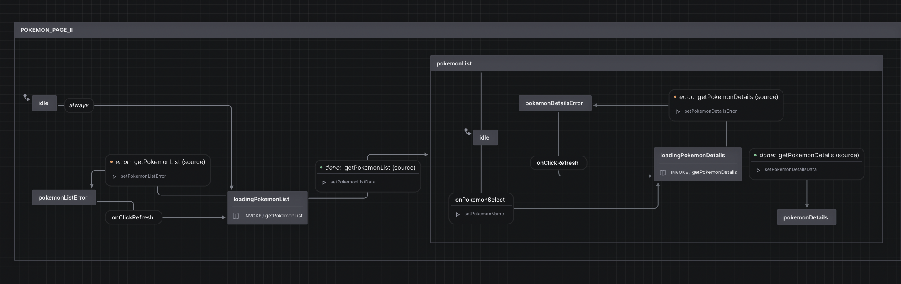

# XState Demo with PokeApi



This example shows how to xstate work with PokeAPI in Next.js. [Learn more about XState](https://xstate.js.org/).

## How to use

install `node_modules` by running

```bash
pnpm install
```

## What's Next?

- [ ] create standardization in naming state
- [ ] use model based testing
- [ ] integrate e2e testing with cypress / playwright

## References

- [xstate](https://github.com/davidkpiano/xstate) repository
- [@xstate/react](https://xstate.js.org/docs/packages/xstate-react) documentation
- [@xstate/inspect](https://xstate.js.org/docs/packages/xstate-inspect/#faqs) usage with Next.JS
